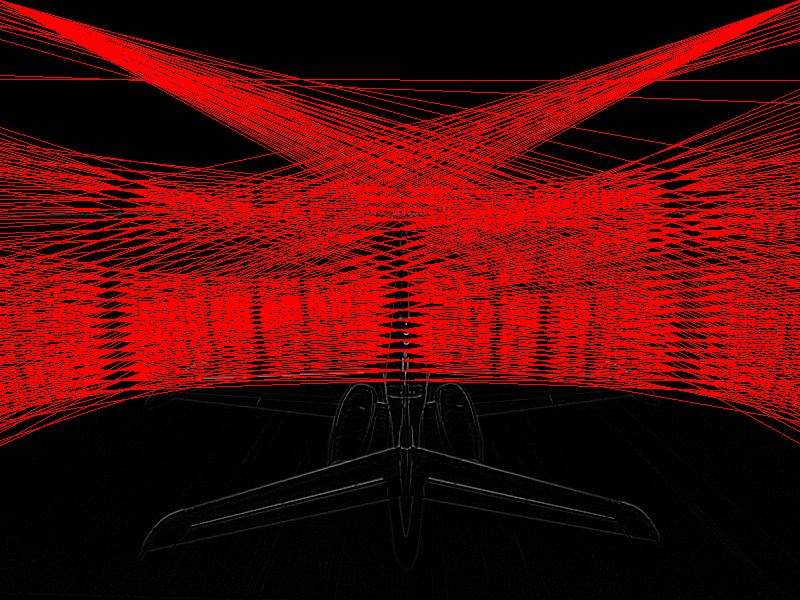

# hough-transform
Hough transform using CUDA exploring different kernel memory types.



# Instructions

Compilation:
```
make
```


Using (houghBase):
```
houghBase.exe <pgm file path> --output <jpg or png filename including extension> --threshold <optional float>
```
