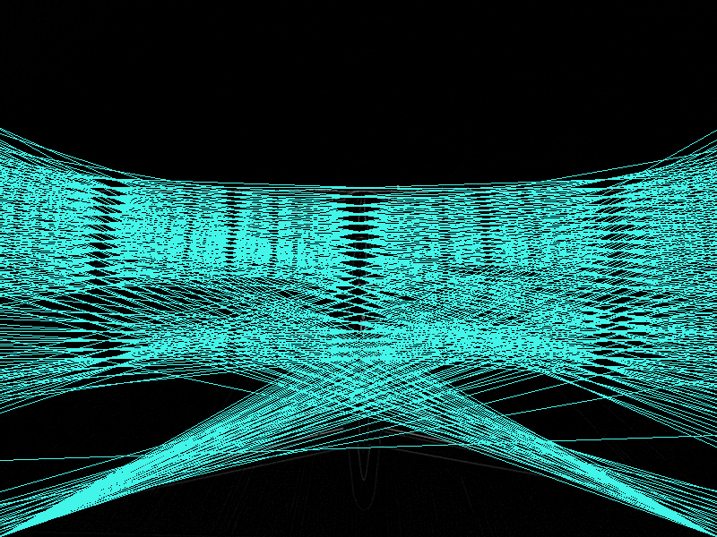

# hough-transform
Hough transform using CUDA exploring different kernel memory types.


## Instructions

Compilation:
```
make
```


Using (houghBase):
```
houghBase.exe <pgm file path> --output <jpg or png filename including extension> --threshold <optional float>
```

Direct Usage Variations Example:

```
bin/houghShared.exe input/runway.pgm --output output/low_threshold.png --threshold 1000
```

Automatic: threshold = average + 2 * std_dev; In this scenario: 3541.583252
```
bin/houghShared.exe input/runway.pgm --output output/automatic_threshold.png
```


```
bin/houghShared.exe input/runway.pgm --output output/high_threshold.png --threshold 4200
```

## Gallery


